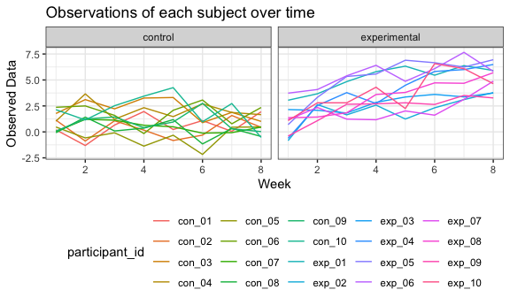

p8105\_hw5\_qg2155
================
Qiu Xia (Helen) Guan
11/3/2018

Question 1
----------

### Importing and cleaning the dataset

``` r
load_study_data = function(file) {
  df = read_csv(paste("./data", file, sep = "/")) %>% 
    janitor::clean_names() %>%
    gather(key = week, value = observed_data, week_1:week_8) %>% 
    mutate(participant_id = file,
           arm_type = str_replace(participant_id, "_.*", ""),
           arm_type = str_replace(arm_type, "con", "control"),
           arm_type = str_replace(arm_type, "exp", "experimental"),
           participant_id = str_replace(participant_id, ".csv", ""),
           week = str_replace(week, "week_", "")) %>% 
    select(participant_id, arm_type, week, observed_data)
  
  df
}

study_data = map_dfr(list.files(path = "./data"), load_study_data)
```

``` r
study_data
```

    ## # A tibble: 160 x 4
    ##    participant_id arm_type week  observed_data
    ##    <chr>          <chr>    <chr>         <dbl>
    ##  1 con_01         control  1              0.2 
    ##  2 con_01         control  2             -1.31
    ##  3 con_01         control  3              0.66
    ##  4 con_01         control  4              1.96
    ##  5 con_01         control  5              0.23
    ##  6 con_01         control  6              1.09
    ##  7 con_01         control  7              0.05
    ##  8 con_01         control  8              1.94
    ##  9 con_02         control  1              1.13
    ## 10 con_02         control  2             -0.88
    ## # ... with 150 more rows

This dataset has 160 rows of observed data and 4 variables. There are a total of 20 participants, in which 10 are in the experimental group and 10 in control group. The variable participant\_id shows the study arm that the participant belongs to and their id number in their study arm. I also created a study arm variable to make it easier to group the participants by their treatment group. The week variable shows the weeks 1 to 8 and the observed data shows the collected data for each participant for every week.

### Plot

``` r
study_data %>% 
  group_by(arm_type) %>% 
  ggplot(aes(x = week, y = observed_data, color = arm_type)) +
  geom_line() +
  labs(
    title = "Observations of each subject over time",
    x = "Week",
    y = "Observed Data"
  )
```



This spaghetti plot shows that at week 1, there is no distinction between the control and experimental group because the observed line only has one color. This makes sense because the participants just started their treatment so the results of the experimental group can not yet be seen. Participants in the experimental group at week 1 should be very similar to those in the control group. As the number of weeks progress, we can start to see the observed data for control increase whereas the experimental group decreases. This could possibly mean that the conditions in the control group are getting worse whereas those in the experimental group are improving. At weeks 7 and 8, there is a distinction between the experimental and control group because the two colored lines are no longer overlapping. The differences between the two groups are also growing because the gap between the two lines got bigger in week 8 compared to week 7.

Question 2
----------

### Importing and cleaning dataset

``` r
url_base = "https://raw.githubusercontent.com/washingtonpost/data-homicides/master/homicide-data.csv" 

homocide_data_raw = read_csv(url_base)

homocide_data_raw
```

    ## # A tibble: 52,179 x 12
    ##    uid   reported_date victim_last victim_first victim_race victim_age
    ##    <chr>         <int> <chr>       <chr>        <chr>       <chr>     
    ##  1 Alb-…      20100504 GARCIA      JUAN         Hispanic    78        
    ##  2 Alb-…      20100216 MONTOYA     CAMERON      Hispanic    17        
    ##  3 Alb-…      20100601 SATTERFIELD VIVIANA      White       15        
    ##  4 Alb-…      20100101 MENDIOLA    CARLOS       Hispanic    32        
    ##  5 Alb-…      20100102 MULA        VIVIAN       White       72        
    ##  6 Alb-…      20100126 BOOK        GERALDINE    White       91        
    ##  7 Alb-…      20100127 MALDONADO   DAVID        Hispanic    52        
    ##  8 Alb-…      20100127 MALDONADO   CONNIE       Hispanic    52        
    ##  9 Alb-…      20100130 MARTIN-LEY… GUSTAVO      White       56        
    ## 10 Alb-…      20100210 HERRERA     ISRAEL       Hispanic    43        
    ## # ... with 52,169 more rows, and 6 more variables: victim_sex <chr>,
    ## #   city <chr>, state <chr>, lat <dbl>, lon <dbl>, disposition <chr>

This raw dataset has 52179 rows and 12 columns. The variables are uid, reported date, and victim data that includes last name, first name, race, age, and sex. Location-related variables are city, state, lat, lon. There is also a variable called disposition that describes the results of the case. For example, a homocide is a case that was closed by arrest whereas a case with sufficient evidence but an arrest was not possible (example: suspect died) is labeled as a closed case without arrest.

### Create city\_state variable

``` r
homocide_data = homocide_data_raw %>% 
  mutate(city_state = paste(city,state, sep = ", "))
```

### Number of homocides and unsolved homocides for each city

-   Total number of homocides by city

``` r
homocide_data %>% 
  filter(disposition == "Closed by arrest") %>% 
  group_by(city_state) %>% 
  summarize(homocide_n = n())
```

    ## # A tibble: 51 x 2
    ##    city_state      homocide_n
    ##    <chr>                <int>
    ##  1 Albuquerque, NM        232
    ##  2 Atlanta, GA            600
    ##  3 Baltimore, MD         1002
    ##  4 Baton Rouge, LA        228
    ##  5 Birmingham, AL         453
    ##  6 Boston, MA             304
    ##  7 Buffalo, NY            202
    ##  8 Charlotte, NC          481
    ##  9 Chicago, IL           1462
    ## 10 Cincinnati, OH         385
    ## # ... with 41 more rows

-   Total number of unsolved homocides by city

``` r
homocide_data %>% 
  filter(disposition %in% c("Closed without arrest", "Open/No arrest")) %>% 
  group_by(city_state) %>% 
  summarize(unsolve_homocide_n = n()) 
```

    ## # A tibble: 50 x 2
    ##    city_state      unsolve_homocide_n
    ##    <chr>                        <int>
    ##  1 Albuquerque, NM                146
    ##  2 Atlanta, GA                    373
    ##  3 Baltimore, MD                 1825
    ##  4 Baton Rouge, LA                196
    ##  5 Birmingham, AL                 347
    ##  6 Boston, MA                     310
    ##  7 Buffalo, NY                    319
    ##  8 Charlotte, NC                  206
    ##  9 Chicago, IL                   4073
    ## 10 Cincinnati, OH                 309
    ## # ... with 40 more rows

### Baltimore, MD

``` r
baltimore_data = homocide_data %>% 
  filter(city_state == "Baltimore, MD") 

total_cases = baltimore_data %>% 
  summarize(cases_n = n())

b_homocide = baltimore_data %>% 
  filter(disposition == "Closed by arrest") %>% 
  summarize(homocide_n = n())

b_unsolved_homocide = baltimore_data %>% 
  filter(disposition %in% c("Closed without arrest", "Open/No arrest")) %>% 
  summarize(unsolved_homocide_n = n()) 

baltimore_output = prop.test(x = b_homocide$homocide_n, n = total_cases$cases_n) %>% 
  broom::tidy() 

output_estimate = baltimore_output[c(1,5,6)]
  

total_cases
```

    ## # A tibble: 1 x 1
    ##   cases_n
    ##     <int>
    ## 1    2827

``` r
b_homocide
```

    ## # A tibble: 1 x 1
    ##   homocide_n
    ##        <int>
    ## 1       1002

``` r
b_unsolved_homocide
```

    ## # A tibble: 1 x 1
    ##   unsolved_homocide_n
    ##                 <int>
    ## 1                1825

``` r
baltimore_output
```

    ## # A tibble: 1 x 8
    ##   estimate statistic  p.value parameter conf.low conf.high method
    ##      <dbl>     <dbl>    <dbl>     <int>    <dbl>     <dbl> <chr> 
    ## 1    0.354      239. 6.46e-54         1    0.337     0.372 1-sam…
    ## # ... with 1 more variable: alternative <chr>

``` r
output_estimate
```

    ## # A tibble: 1 x 3
    ##   estimate conf.low conf.high
    ##      <dbl>    <dbl>     <dbl>
    ## 1    0.354    0.337     0.372

Baltimore has a total of 2827 cases. Out of all the cases, 1002 of them were homocides and 1825 were unsolved homocides. 35.4% of the homocides were unsolved, with the 95% confidence interval being 33.7% to 37.2%.

### Unsolved homocides for each city

Create nested dataset using city\_state

``` r
city_nest = nest(homocide_data, uid:disposition)
```

Create function

``` r
individual_city = function(data) {

total_cases = data %>% 
  summarize(cases_n = n())

homocide = data %>% 
  filter(disposition == "Closed by arrest") %>% 
  summarize(homocide_n = n())

unsolved_homocide = data %>% 
  filter(disposition %in% c("Closed without arrest", "Open/No arrest")) %>% 
  summarize(unsolved_homocide_n = n()) 

output = prop.test(x = homocide$homocide_n, n = total_cases$cases_n) %>% 
  broom::tidy() 

tibble(
  estimate = output[[1]],
  upper_ci = output[[5]],
  lower_ci = output[[6]]
)
}
```

``` r
city_results =
  city_nest %>% 
  mutate(city_homocide = map(city_nest$data, individual_city)) %>% 
  unnest(city_homocide)
```

    ## Warning in prop.test(x = homocide$homocide_n, n = total_cases$cases_n):
    ## Chi-squared approximation may be incorrect

``` r
city_results
```

    ## # A tibble: 51 x 5
    ##    city_state      data                  estimate upper_ci lower_ci
    ##    <chr>           <list>                   <dbl>    <dbl>    <dbl>
    ##  1 Albuquerque, NM <tibble [378 × 12]>      0.614    0.562    0.663
    ##  2 Atlanta, GA     <tibble [973 × 12]>      0.617    0.585    0.647
    ##  3 Baltimore, MD   <tibble [2,827 × 12]>    0.354    0.337    0.372
    ##  4 Baton Rouge, LA <tibble [424 × 12]>      0.538    0.489    0.586
    ##  5 Birmingham, AL  <tibble [800 × 12]>      0.566    0.531    0.601
    ##  6 Boston, MA      <tibble [614 × 12]>      0.495    0.455    0.535
    ##  7 Buffalo, NY     <tibble [521 × 12]>      0.388    0.346    0.431
    ##  8 Charlotte, NC   <tibble [687 × 12]>      0.700    0.664    0.734
    ##  9 Chicago, IL     <tibble [5,535 × 12]>    0.264    0.253    0.276
    ## 10 Cincinnati, OH  <tibble [694 × 12]>      0.555    0.517    0.592
    ## # ... with 41 more rows

Create plot of homocide by city

``` r
city_results %>% 
  ggplot(aes(x = city_state, y = estimate)) +
  geom_point() +
  geom_errorbar(aes(ymin = lower_ci, ymax = upper_ci)) +
  labs(
    title = "Proportion of homocide by city",
    x = "City",
    y = "Homocide Proportion"
  ) +
  theme(axis.text.x = element_text(angle = 90, hjust = 1))
```


This graph shows the proportion of homocides for 51 different cities. The proportion of homocide are mostly between 25 to 75 percent, with the exception of a couple of outliers. The city Tulsa, AL only has one data point and is the biggest outlier in the dataset so it could have been a mistake. After googling, it appears that there is no city named Tulsa in AL.

Out of all cities, Chicago has the lowest proportion of homocide with a very narrow confidence interval. New Orleans and Baltimore are both runner ups for low proportion of homocide. This means that out of all the cases that happened in these cities, a very low proportion (25% - 37.5%) of cases were considered homocides (closed with arrest). A majority of cases in these cities closed with no arrest or were still open.
